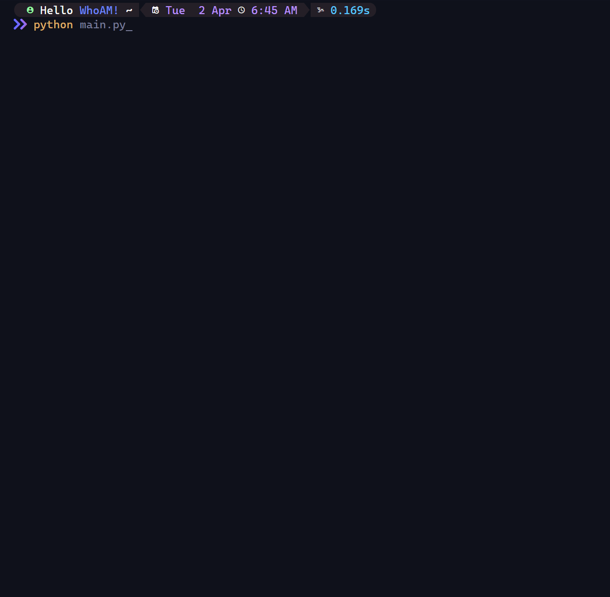
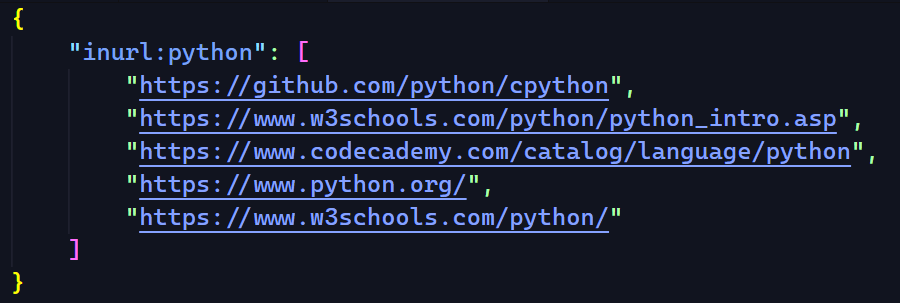

<div align="center">


**Dorks Searcher** is an advanced tool for performing Google queries, also known as Google Dorks, with the added advantage of concurrent searching while equipped with an automatic proxy rotator.



</div>

## **Dork Collections**

-   [13774 Dorks](dorks_collection/dorks.txt)

## **Installation**

**Using** `poetry`

```
git clone https://github.com/x404xx/Dorker-Searcher.git
cd Dorker-Searcher
poetry shell
poetry install
```

**Using** `pip`

```
git clone https://github.com/x404xx/Dorker-Searcher.git
cd Dorker-Searcher
virtualenv env
env/scripts/activate
pip install -r requirements.txt
```

## **Usage**

```
usage: main.py [-h] [-d DORK] [-w WORKER] [-a AMOUNT] [-i] [-f FILE]

Scrape URLs using Dork

options:
  -h, --help            show this help message and exit
  -d DORK, --dork DORK  Dorks
  -w WORKER, --worker WORKER
                        How many worker
  -a AMOUNT, --amount AMOUNT
                        How many URLs to be scrape
  -i, --info            Status info
  -f FILE, --file FILE  Output filename (Without Ext)
```

## **Usage Example**

Running _**Dorker**_ with command-line - info ::

```python
python main.py -d YOUR_DORK -w WORKER/THREADS -a URL_AMOUNT
```

Running _**Dorker**_ with full command-line + info + filename::

```python
python main.py -d YOUR_DORK -w WORKER/THREADS -a URL_AMOUNT -i -f OUTPUT_FILENAME(Without Extension)
```

Alternatively, you can run _**Dorker**_ without command-line. The program will handle anything for you ::

```python
python main.py
```

## **Example JSON File**



## **Legal Disclaimer**

> **Note**
> This was made for educational purposes only, nobody which directly involved in this project is responsible for any damages caused. **_You are responsible for your actions._**
